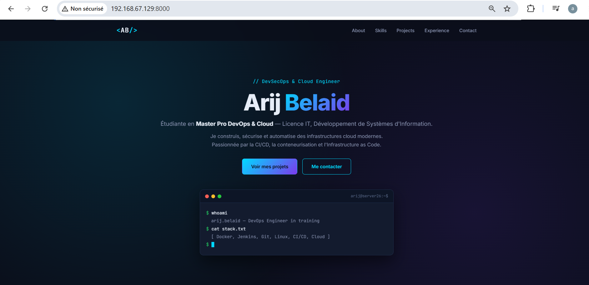

# DevSecOps Portfolio — Arij Belaid

Application **one page** évolutive, réalisée en **HTML5 / CSS3 / JavaScript**,
présentant le profil, les compétences et les projets d'une étudiante en
**Master Pro DevOps & Cloud**.

## 👩‍💻 À propos

Étudiante en **Master Pro DevOps & Cloud**, titulaire d'une **Licence IT —
Développement de Systèmes d'Information**. Passionnée par l'automatisation,
la conteneurisation, la CI/CD et la sécurisation d'infrastructures Linux.

## 📸 Aperçu de la nouvelle version



## 🆕 Principales améliorations (v2)

| Domaine | v1 — Mini CV | v2 — DevSecOps Portfolio |
|---|---|---|
| **Structure** | CV statique | Application one page avec navbar fixe |
| **Sections** | Profil, Compétences, Formation | **About / Skills / Projects / Experience / Contact** (obligatoires) |
| **Navigation** | Aucune | Menu sticky + smooth scroll + menu mobile |
| **Design** | Cartes simples | Thème dark "DevOps" + gradients cyan/violet |
| **Hero** | Titre simple | **Terminal animé** (effet typing) |
| **Compétences** | Tags statiques | **Barres de progression animées** + icônes |
| **Projets** | Liste simple | **Cartes projets** avec tags technologiques |
| **Expérience** | Liste | **Timeline verticale** avec points animés |
| **Contact** | Texte brut | Cartes cliquables (mailto, GitHub, LinkedIn) |
| **Animations** | Fade-in basique | IntersectionObserver + reveal au scroll |
| **Responsive** | Basique | Complet (navbar mobile, grilles adaptatives) |
| **Accessibilité** | — | `aria-label`, focus visibles, contrastes |

## 🛠️ Stack technique

- **HTML5** — structure sémantique (`<nav>`, `<section>`, `<article>`, `<header>`, `<footer>`)
- **CSS3** — variables, Grid, Flexbox, gradients, animations, backdrop-filter
- **JavaScript (ES6)** — IntersectionObserver, gestion événementielle, DOM
- **Git / GitHub** — versionnement + push via **SSH**

## 🔐 Push GitHub via SSH

```bash
# 1. Générer la clé
ssh-keygen -t ed25519 -C "aarijbelaid@gmail.com"

# 2. Ajouter la clé publique sur GitHub :
#    Settings → SSH and GPG keys → New SSH key

# 3. Tester
ssh -T git@github.com
# → Hi arijbelaid! You've successfully authenticated...

# 4. Configurer le remote en SSH
git remote set-url origin git@github.com:arijbelaid/cv-onepage.git

# 5. Pousser
git push -u origin main
