# DevSecOps Portfolio — Arij Belaid

Application **One Page** évolutive réalisée en **HTML5 / CSS3 / JavaScript**, puis progressivement intégrée dans une démarche **DevSecOps** avec **Git, GitHub, SSH, Docker, Nginx, Docker Compose, Jenkins et Vagrant**.

Le projet a été réalisé sur une **VM Ubuntu Server** et permet de mettre en pratique l'administration Linux, la sécurisation SSH, la conteneurisation, le versionnement Git et les premières étapes d'automatisation.

---
## 📄 Rapport complet (PDF)

Le rapport détaillé du projet est disponible ici :

👉 **[Télécharger le rapport PDF](./rapport-devsecops-arij-belaid.pdf)**

---


## 📋 Sommaire

* [1. Installation d'Ubuntu Server et accès SSH](#1-installation-dubuntu-server-et-accès-ssh)
* [2. Test de l'accès SSH depuis la machine physique](#2-test-de-laccès-ssh-depuis-la-machine-physique)
* [3. Installation de Docker](#3-installation-de-docker)
* [4. Installation et configuration de Jenkins](#4-installation-et-configuration-de-jenkins)
* [5. Création du mini CV One Page](#5-création-du-mini-cv-one-page)
* [6. Configuration des Push GitHub via SSH](#6-configuration-des-push-github-via-ssh)
* [7. Évolution vers un DevSecOps Portfolio](#7-évolution-vers-un-devsecops-portfolio)
* [8. Section DevSecOps Skills](#8-section-devsecops-skills)
* [9. Génération dynamique des Projects](#9-génération-dynamique-des-projects)
* [10. Dockerisation avec Nginx](#10-dockerisation-avec-nginx)
* [11. Construction de l'image cv-docker](#11-construction-de-limage-cv-docker)
* [12. Exécution du conteneur](#12-exécution-du-conteneur)
* [13. Déploiement avec Docker Compose](#13-déploiement-avec-docker-compose)
* [14. Publication sur GitHub via SSH](#14-publication-sur-github-via-ssh)
* [15. Installation et utilisation de Vagrant](#15-installation-et-utilisation-de-vagrant)
* [16. Connexion avec vagrant ssh](#16-connexion-avec-vagrant-ssh)

---

# 1. Installation d'Ubuntu Server et accès SSH

## 🎯 Objectif

Installer **Ubuntu Server** sur une machine virtuelle et configurer un accès distant sécurisé avec **SSH**.

L'objectif est de pouvoir administrer la VM depuis la machine physique sans utiliser directement la console de la VM.

## 🔐 Vérification du service SSH

Après l'installation d'Ubuntu Server, le service SSH est vérifié avec :

```bash
sudo systemctl status ssh
```

Le service doit être actif :

```text
Active: active (running)
```

## 🔒 Sécurisation de SSH

La configuration SSH est vérifiée et sécurisée afin de permettre une administration distante contrôlée.

Le fichier de configuration principal est :

```bash
sudo nano /etc/ssh/sshd_config
```

Après modification de la configuration, le service SSH est redémarré :

```bash
sudo systemctl restart ssh
```

Puis son état est vérifié :

```bash
sudo systemctl status ssh
```

## 📸 Capture 01 — Service SSH

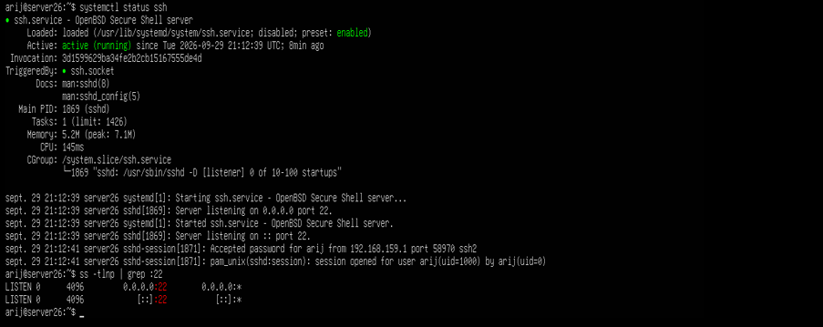

**Nom de la capture :**

```text
01-ssh-service.png
```

---

# 2. Test de l'accès SSH depuis la machine physique

## 🎯 Objectif

Tester la connexion SSH entre la **machine physique Windows** et la **VM Ubuntu Server**.

Depuis PowerShell sur Windows :

```powershell
ssh arij@IP_DE_LA_VM
```

Exemple :

```powershell
ssh arij@192.168.X.X
```

Une fois la connexion établie, le terminal affiche le shell de la VM Ubuntu Server.

## 📸 Capture 02 — Connexion SSH depuis Windows

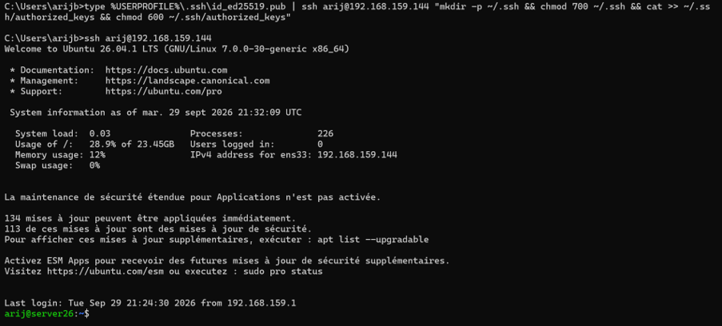

**Nom de la capture :**

```text
02-ssh-windows.png
```

---

# 3. Installation de Docker

## 🎯 Objectif

Installer **Docker Engine** sur Ubuntu Server afin de pouvoir conteneuriser et déployer le Portfolio.

## 📦 Installation des dépendances

Les dépendances nécessaires sont installées :

```bash
sudo apt update
sudo apt install ca-certificates curl gnupg
```

## 🔑 Ajout de la clé GPG Docker

Création du répertoire des clés :

```bash
sudo install -m 0755 -d /etc/apt/keyrings
```

Ajout de la clé officielle Docker :

```bash
curl -fsSL https://download.docker.com/linux/ubuntu/gpg | \
sudo gpg --dearmor -o /etc/apt/keyrings/docker.gpg
```

## 📦 Ajout du dépôt Docker

Le dépôt officiel Docker est ajouté aux sources APT.

## 🚀 Installation de Docker

```bash
sudo apt update
sudo apt install docker-ce docker-ce-cli containerd.io docker-buildx-plugin docker-compose-plugin
```

## ✅ Vérification du service

```bash
sudo systemctl status docker
```

Le service doit être actif :

```text
Active: active (running)
```

## 👤 Utilisation de Docker sans sudo

L'utilisateur est ajouté au groupe Docker :

```bash
sudo usermod -aG docker $USER
```

Une nouvelle session est ensuite ouverte afin d'appliquer les changements.

## 🧪 Test final

```bash
docker run hello-world
```

Cette commande permet de vérifier que Docker fonctionne correctement.

## 📸 Capture 03 — Installation de Docker

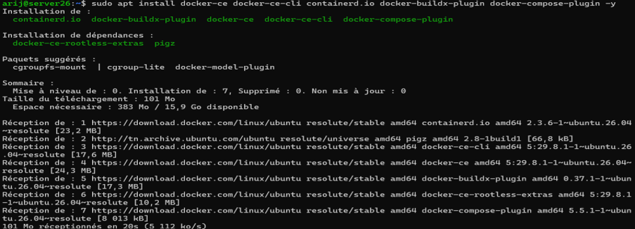

**Nom de la capture :**

```text
03-docker-installation.png
```

## 📸 Capture 04 — Vérification de Docker

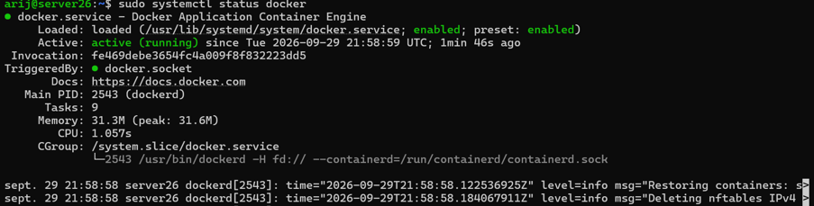

**Nom de la capture :**

```text
04-docker-service-test.png
```

---

# 4. Installation et configuration de Jenkins

## 🎯 Objectif

Installer **Jenkins en tant que service** afin de préparer l'environnement à l'automatisation et à la CI/CD.

## ☕ Installation de Java

Jenkins nécessite Java.

```bash
sudo apt update
sudo apt install fontconfig openjdk-21-jre
```

Vérification :

```bash
java -version
```

## 🔑 Ajout de la clé GPG Jenkins

La clé officielle Jenkins est ajoutée afin de pouvoir utiliser son dépôt.

## 📦 Ajout du dépôt Jenkins

Le dépôt Jenkins est ajouté aux sources APT.

## 🚀 Installation de Jenkins

```bash
sudo apt update
sudo apt install jenkins
```

## ▶️ Démarrer et activer Jenkins

```bash
sudo systemctl start jenkins
sudo systemctl enable jenkins
```

Vérification :

```bash
sudo systemctl status jenkins
```

## 🔥 Ouverture du port 8080

Le port utilisé par Jenkins est ouvert dans le pare-feu :

```bash
sudo ufw allow 8080/tcp
```

Vérification :

```bash
sudo ufw status
```

## 🔑 Récupération du mot de passe initial

```bash
sudo cat /var/lib/jenkins/secrets/initialAdminPassword
```

## 🌐 Accès depuis la machine physique

Depuis Windows, Jenkins est accessible avec :

```text
http://IP_DE_LA_VM:8080
```

## 📸 Capture 05 — Service Jenkins

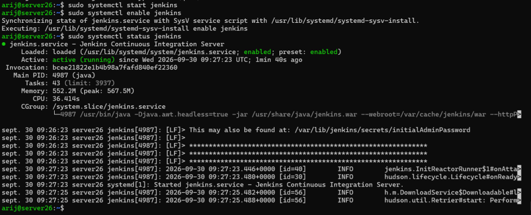

**Nom de la capture :**

```text
05-jenkins-service.png
```

## 📸 Capture 06 — Jenkins depuis Windows

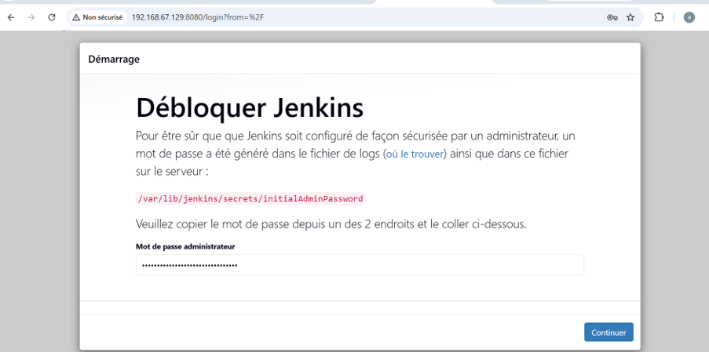

**Nom de la capture :**

```text
06-jenkins-web.png
```

---

# 5. Création du mini CV One Page

## 🎯 Objectif

Créer un **mini CV One Page** en utilisant :

* HTML5
* CSS3
* JavaScript
* Git

## 📁 Création du projet

Un dossier dédié au projet est créé :

```bash
mkdir cv-onepage
cd cv-onepage
```

Initialisation du dépôt Git :

```bash
git init
```

## 🔎 Vérification de Git

```bash
git --version
```

## ⚙️ Configuration de Git

```bash
git config --global user.name "Arij Belaid"
git config --global user.email "aarijbelaid@gmail.com"
```

## 📄 Fichiers du mini CV

Le projet contient notamment :

```text
cv-onepage/
├── index.html
├── style.css
└── script.js
```

### `index.html`

Structure HTML5 du CV.

### `style.css`

Mise en forme et design du CV.

### `script.js`

Gestion des interactions JavaScript.

## 📸 Capture 07 — Mini CV

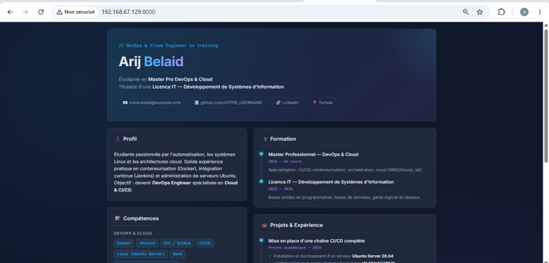

**Nom de la capture :**

```text
07-mini-cv.png
```

## 🔗 Dépôt GitHub

👉 **https://github.com/arijbelaid/cv-onepage**

---

# 6. Configuration des Push GitHub via SSH

## 🎯 Objectif

Configurer une authentification SSH entre la VM Ubuntu et GitHub afin de pouvoir effectuer des `git push` sans utiliser de mot de passe ou de token.

## 🔑 Vérifier les clés SSH existantes

```bash
ls -la ~/.ssh
```

## 🔐 Générer une paire de clés ED25519

```bash
ssh-keygen -t ed25519 -C "aarijbelaid@gmail.com"
```

La clé est générée dans :

```text
~/.ssh/id_ed25519
```

et la clé publique dans :

```text
~/.ssh/id_ed25519.pub
```

## 📋 Afficher la clé publique

```bash
cat ~/.ssh/id_ed25519.pub
```

La clé publique est ensuite ajoutée dans :

**GitHub → Settings → SSH and GPG keys → New SSH key**

## 🧪 Tester la connexion SSH avec GitHub

```bash
ssh -T git@github.com
```

Résultat attendu :

```text
Hi arijbelaid! You've successfully authenticated...
```

## 🔗 Configurer le dépôt local avec SSH

```bash
git remote set-url origin git@github.com:arijbelaid/cv-onepage.git
```

Vérification :

```bash
git remote -v
```

Résultat :

```text
origin  git@github.com:arijbelaid/cv-onepage.git (fetch)
origin  git@github.com:arijbelaid/cv-onepage.git (push)
```

## 📸 Capture 08 — Clé SSH GitHub

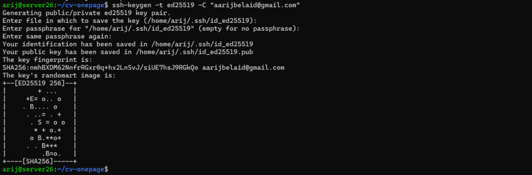

**Nom de la capture :**

```text
08-github-ssh-key.png
```

## 📸 Capture 09 — Test SSH GitHub

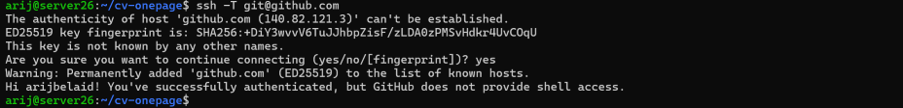

**Nom de la capture :**

```text
09-github-ssh-test.png
```

---

# 7. Évolution vers un DevSecOps Portfolio

## 🎯 Objectif

Faire évoluer le mini CV vers une petite application **DevSecOps Portfolio**.

Le Portfolio contient les sections principales :

* About
* Skills
* Projects
* Experience
* Contact

## 🛠️ Principales améliorations

Le mini CV initial a été transformé en une application One Page plus complète avec :

* une présentation personnelle ;
* une section About ;
* une section Skills ;
* une section DevSecOps ;
* une section Projects ;
* une section Experience ;
* une section Contact ;
* une interface responsive ;
* une organisation adaptée à un profil DevOps & Cloud.

Les fichiers principaux restent :

```text
index.html
style.css
script.js
```

## 🚀 Lancement en local

Le Portfolio peut être ouvert localement dans un navigateur afin de vérifier son fonctionnement avant publication.

## 📸 Capture 10 — DevSecOps Portfolio

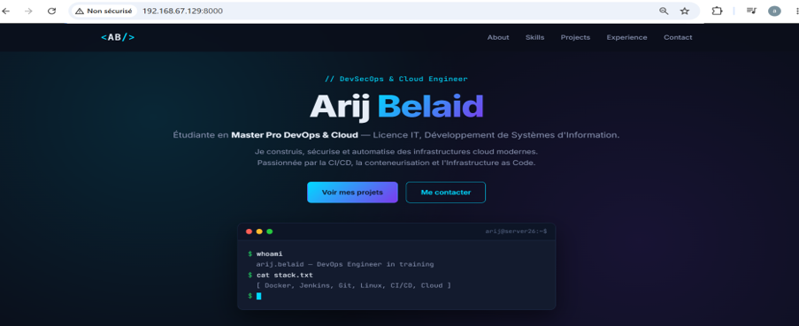

**Nom de la capture :**

```text
10-devsecops-portfolio.png
```

## 🌐 Démo en ligne

👉 **https://arijbelaid.github.io/cv-onepage/**

---

# 8. Section DevSecOps Skills

## 🎯 Objectif

Ajouter une section dédiée aux technologies DevSecOps utilisées ou étudiées pendant le projet.

## 🧰 Technologies présentées

La section **DevSecOps Skills** présente :

* Git
* Docker
* Jenkins
* Kubernetes
* Ansible
* Terraform
* Argo CD

Cette section permet de présenter clairement la stack technique associée au profil DevOps & Cloud.

## 📸 Capture 11 — DevSecOps Skills

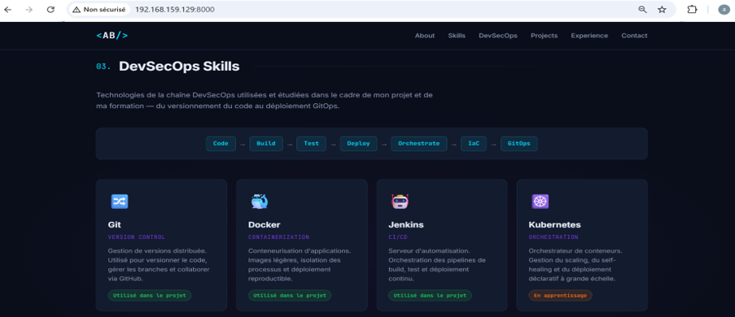

**Nom de la capture :**

```text
11-devsecops-skills.png
```

---

# 9. Génération dynamique des Projects

## 🎯 Objectif

La section **Projects** est générée dynamiquement en JavaScript à partir d'un **tableau d'objets**.

Les projets ne sont donc pas écrits individuellement dans le HTML : JavaScript génère automatiquement les cartes dans le DOM.

## 📄 Tableau des projets

### Extrait de `script.js`

```javascript
const projectsData = [
    {
        title: "Chaîne CI/CD complète sur Ubuntu Server",
        year: "2026",
        description: "Installation et sécurisation d'un serveur Ubuntu Server, déploiement de Docker et Jenkins.",
        tags: ["Ubuntu", "Docker", "Jenkins", "SSH", "UFW"],
        link: "https://github.com/arijbelaid/cv-onepage"
    },
    {
        title: "DevSecOps Portfolio",
        year: "2026",
        description: "Application One Page responsive développée en HTML5, CSS3 et JavaScript.",
        tags: ["HTML5", "CSS3", "JavaScript", "Git", "GitHub Pages"],
        link: "https://github.com/arijbelaid/cv-onepage"
    }
];
```

## 🧩 Génération d'une carte

```javascript
function createProjectCard(project) {
    const tagsHTML = project.tags
        .map(tag => `<li>${tag}</li>`)
        .join('');

    return `
        <article class="project-card">
            <div class="project-header">
                <span class="project-folder">📁</span>
                <span class="project-year">${project.year}</span>
            </div>

            <h3>${project.title}</h3>
            <p>${project.description}</p>

            <ul class="project-tags">
                ${tagsHTML}
            </ul>
        </article>
    `;
}
```

## 📌 Injection des projets dans le DOM

```javascript
function renderProjects() {
    const grid = document.getElementById('projectsGrid');

    if (!grid) return;

    grid.innerHTML = projectsData
        .map(createProjectCard)
        .join('');
}

renderProjects();
```

Cette approche permet d'ajouter facilement de nouveaux projets en ajoutant simplement un nouvel objet dans `projectsData`.

## 📸 Capture 12 — Projects dynamiques

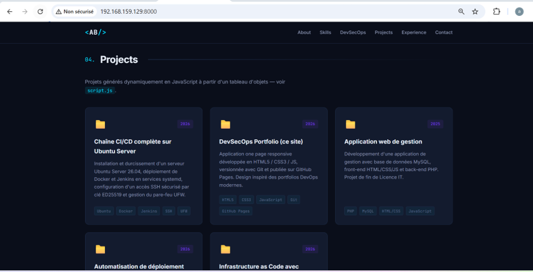

**Nom de la capture :**

```text
12-projects-dynamic.png
```

---

# 10. Dockerisation avec Nginx

## 🎯 Objectif

Créer un **Dockerfile** permettant de servir le DevSecOps Portfolio avec **Nginx**.

## 📁 Fichiers Docker

La dockerisation utilise notamment :

```text
Dockerfile
nginx.conf
.dockerignore
```

## 🐳 Dockerfile

```dockerfile
FROM nginx:alpine

COPY . /usr/share/nginx/html

EXPOSE 80

CMD ["nginx", "-g", "daemon off;"]
```

## 📄 Explication

### Image de base

```dockerfile
FROM nginx:alpine
```

Utilisation d'une image Nginx légère basée sur Alpine Linux.

### Copie du Portfolio

```dockerfile
COPY . /usr/share/nginx/html
```

Les fichiers du Portfolio sont copiés dans le répertoire utilisé par Nginx pour servir les fichiers statiques.

### Port

```dockerfile
EXPOSE 80
```

Le conteneur expose le port HTTP 80.

### Démarrage de Nginx

```dockerfile
CMD ["nginx", "-g", "daemon off;"]
```

Nginx est exécuté au premier plan afin que le conteneur reste actif.

---

# 11. Construction de l'image `cv-docker`

## 🎯 Objectif

Construire une image Docker nommée :

```text
cv-docker
```

## 🔨 Construction

Depuis le répertoire du projet :

```bash
docker build -t cv-docker .
```

## 🔎 Vérification

```bash
docker images
```

L'image `cv-docker` doit apparaître dans la liste des images Docker.

## 📸 Capture 13 — Image Docker `cv-docker`

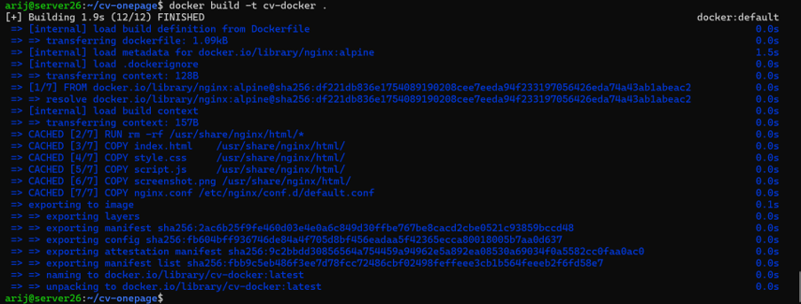

**Nom de la capture :**

```text
13-docker-build-cv-docker.png
```

---

# 12. Exécution du conteneur

## 🎯 Objectif

Lancer l'image `cv-docker` dans un conteneur et rendre le Portfolio accessible depuis la machine physique.

## 🚀 Lancer le conteneur

Le rapport utilise le port **8082** pour cette étape :

```bash
docker run -d --name cv-docker-container -p 8082:80 cv-docker
```

## 🔎 Vérifier le conteneur

```bash
docker ps
```

Le conteneur doit apparaître avec un mapping similaire à :

```text
0.0.0.0:8082->80/tcp
```

## 🔥 Ouvrir le port dans UFW

```bash
sudo ufw allow 8082/tcp
```

## 🧪 Tester depuis la VM

```bash
curl http://localhost:8082
```

## 🌐 Tester depuis la machine physique

Depuis le navigateur Windows :

```text
http://IP_DE_LA_VM:8082
```

Le Portfolio doit être accessible depuis la machine physique.

## 📸 Capture 14 — Docker Run et Docker PS

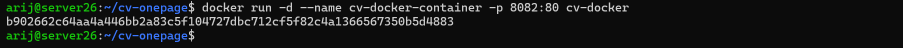

**Nom de la capture :**

```text
14-docker-run-ps.png
```

## 📸 Capture 15 — Portfolio depuis la machine physique

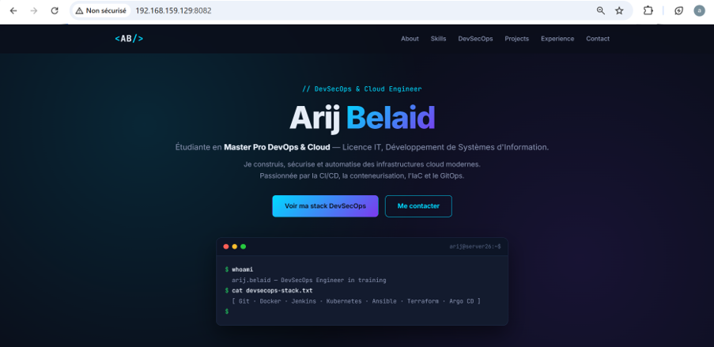

**Nom de la capture :**

```text
15-portfolio-docker-windows.png
```

---

# 13. Déploiement avec Docker Compose

## 🎯 Objectif

Automatiser le déploiement du Portfolio avec **Docker Compose**.

## 📄 Fichier Docker Compose

Le projet contient :

```text
docker-compose.yml
```

Le fichier permet de définir le service du Portfolio et sa configuration de déploiement.

## 🚀 Démarrer avec Docker Compose

```bash
docker compose up -d
```

L'option `-d` permet de lancer les services en arrière-plan.

## 🔎 Vérifier les services

```bash
docker compose ps
```

Le service doit apparaître avec l'état :

```text
Up
```

ou selon la configuration :

```text
healthy
```

## 📸 Capture 16 — Docker Compose

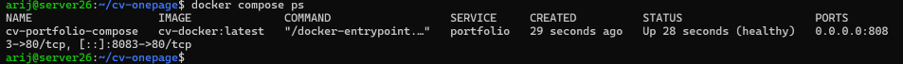

**Nom de la capture :**

```text
16-docker-compose-ps.png
```

---

# 14. Publication sur GitHub via SSH

## 🎯 Objectif

Publier toutes les modifications du projet sur GitHub en utilisant l'authentification SSH.

## 🔗 Dépôt GitHub

👉 **https://github.com/arijbelaid/cv-onepage**

## ⚙️ Vérifier l'état du dépôt

```bash
git status
```

## ➕ Ajouter les modifications

```bash
git add .
```

## 📝 Créer un commit

```bash
git commit -m "feat: deployment with Docker Compose"
```

## 🚀 Publier sur GitHub

```bash
git push
```

## 🔎 Vérifier le remote

```bash
git remote -v
```

Résultat attendu :

```text
origin  git@github.com:arijbelaid/cv-onepage.git (fetch)
origin  git@github.com:arijbelaid/cv-onepage.git (push)
```

## 🔐 Vérifier l'authentification SSH

```bash
ssh -T git@github.com
```

Résultat attendu :

```text
Hi arijbelaid! You've successfully authenticated...
```

## 📜 Historique des commits

```bash
git log --oneline
```

Quelques versions du projet :

```text
feat(v8): déploiement avec Docker Compose + healthcheck healthy
feat(v7): exécution du conteneur cv-docker + accès depuis la machine physique
feat(v5): Dockerfile Nginx + capture du portfolio conteneurisé
feat(v4): section Projects générée dynamiquement en JavaScript
feat(v3): ajout section DevSecOps Skills
feat(v2): évolution DevSecOps Portfolio
feat: CV one page Arij Belaid - HTML5/CSS3/JS
```

## 📸 Capture 17 — Git Push GitHub

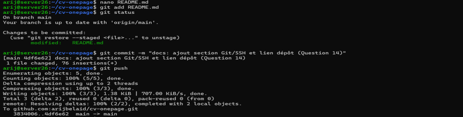

**Nom de la capture :**

```text
17-git-push-github.png
```

---

# 15. Installation et utilisation de Vagrant

## 🎯 Objectif

Introduire l'automatisation de la création de machines virtuelles avec **Vagrant**.

Vagrant permet de définir la configuration d'une VM dans un fichier `Vagrantfile` et de créer automatiquement cette VM.

## 🔄 Mise à jour du système

```bash
sudo apt update
sudo apt upgrade -y
```

## 🔑 Ajout de la clé GPG HashiCorp

La clé officielle HashiCorp est ajoutée afin de permettre l'installation de Vagrant depuis son dépôt.

## 📦 Ajout du dépôt HashiCorp

Le dépôt HashiCorp est ajouté aux sources APT.

## 🚀 Installation de Vagrant

```bash
sudo apt update
sudo apt install vagrant
```

## 🔎 Vérification

```bash
vagrant --version
```

Exemple :

```text
Vagrant x.x.x
```

## 💻 Installation de VirtualBox

VirtualBox est utilisé comme provider pour Vagrant.

## 📁 Création du projet Vagrant

```bash
mkdir vagrant-ubuntu
cd vagrant-ubuntu
```

## 📄 Création du Vagrantfile

```bash
vagrant init generic/ubuntu2204
```

Un fichier :

```text
Vagrantfile
```

est alors créé.

## 📝 Exemple de configuration

```ruby
Vagrant.configure("2") do |config|

  config.vm.box = "generic/ubuntu2204"

  config.vm.provider "virtualbox" do |vb|
    vb.memory = 2048
    vb.cpus = 2
  end

end
```

## 🚀 Création automatique de la VM

```bash
vagrant up
```

Vagrant télécharge la box si nécessaire puis crée et démarre automatiquement la VM.

## 🔎 Vérification

```bash
vagrant status
```

La VM doit apparaître comme active.

## 📸 Capture 18 — Installation de Vagrant

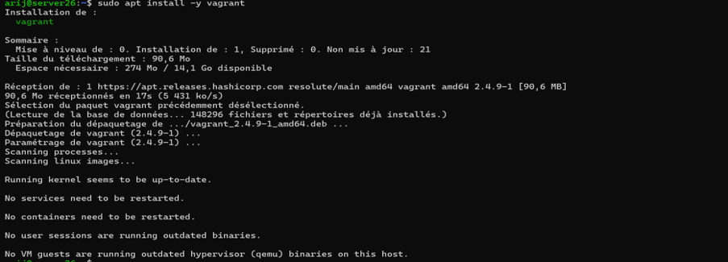

**Nom de la capture :**

```text
18-vagrant-installation.png
```

## 📸 Capture 19 — Vagrantfile

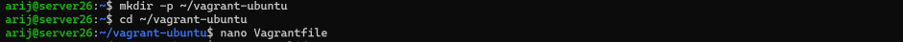

**Nom de la capture :**

```text
19-vagrantfile.png
```

## 📸 Capture 20 — Vagrant Up

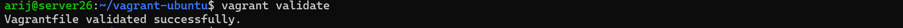

**Nom de la capture :**

```text
20-vagrant-up.png
```

---

# 16. Connexion avec `vagrant ssh`

## 🎯 Objectif

Se connecter directement à la VM créée automatiquement par Vagrant.

## 🔐 Connexion

Depuis le répertoire contenant le `Vagrantfile` :

```bash
vagrant ssh
```

Cette commande ouvre directement une session SSH vers la VM gérée par Vagrant.

## 📸 Capture 21 — Vagrant SSH

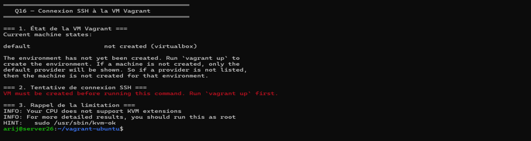

**Nom de la capture :**

```text
21-vagrant-ssh.png
```

## ⚖️ Comparaison : VM manuelle vs Vagrant

| Création manuelle                      | Vagrant                                     |
| -------------------------------------- | ------------------------------------------- |
| Configuration réalisée étape par étape | Configuration définie dans un `Vagrantfile` |
| Création manuelle de la VM             | Création automatisée avec `vagrant up`      |
| Configuration moins reproductible      | Configuration reproductible                 |
| Gestion manuelle des paramètres        | Paramètres définis dans le code             |
| Connexion manuelle                     | Connexion simplifiée avec `vagrant ssh`     |
| Plus longue à reproduire               | Plus rapide à recréer                       |

Vagrant permet donc d'améliorer la **reproductibilité**, l'**automatisation** et la gestion des environnements de développement.

---

# 🐳 Architecture du projet

L'évolution du projet peut être représentée ainsi :

```text
                    ┌─────────────────────┐
                    │    Machine Windows  │
                    │      physique      │
                    └──────────┬──────────┘
                               │
                         SSH / HTTP
                               │
                               ▼
                    ┌─────────────────────┐
                    │   Ubuntu Server VM  │
                    ├─────────────────────┤
                    │         SSH         │
                    │       Jenkins       │
                    │        Docker       │
                    │       Vagrant       │
                    └──────────┬──────────┘
                               │
                               ▼
                    ┌─────────────────────┐
                    │       Docker        │
                    │                     │
                    │  ┌───────────────┐  │
                    │  │ Nginx         │  │
                    │  │ Portfolio     │  │
                    │  └───────────────┘  │
                    └──────────┬──────────┘
                               │
                               ▼
                         GitHub Pages
                               │
                               ▼
              https://arijbelaid.github.io/
                       cv-onepage/
```

---

# 🧰 Technologies utilisées

## Frontend

* HTML5
* CSS3
* JavaScript

## Versionnement

* Git
* GitHub
* GitHub Pages
* SSH

## DevOps / DevSecOps

* Ubuntu Server
* Docker
* Nginx
* Docker Compose
* Jenkins
* Kubernetes
* Ansible
* Terraform
* Argo CD

## Automatisation

* Vagrant
* VirtualBox

---
## 17. Configuration automatique de la VM avec Vagrant

Le **Vagrantfile** a été modifié afin de configurer automatiquement les principaux paramètres de la machine virtuelle :

* Nom de la VM
* Adresse IP privée
* Mémoire RAM
* Nombre de CPU

### ⚙️ Configuration utilisée

```ruby
Vagrant.configure("2") do |config|

  config.vm.box = "generic/ubuntu2204"

  # Nom de la VM
  config.vm.hostname = "vagrant-vm"

  # Adresse IP privée
  config.vm.network "private_network", ip: "192.168.159.130"

  # Configuration des ressources
  config.vm.provider "virtualbox" do |vb|
    vb.memory = 2048
    vb.cpus = 2
  end

end
```

### 📄 Vagrantfile

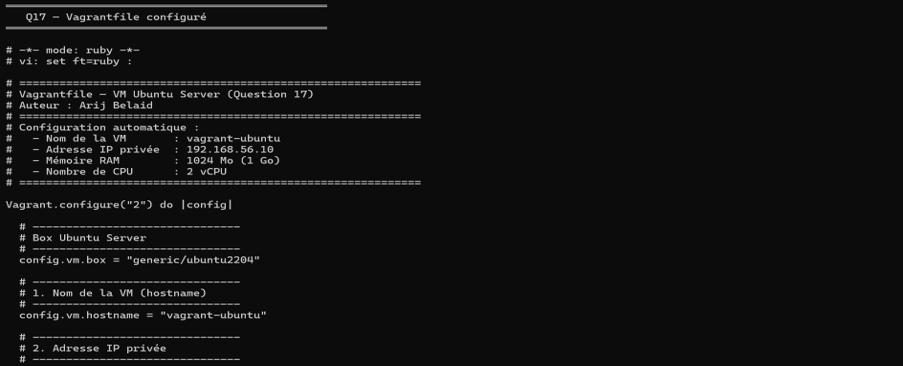

### 📄 Configuration complète

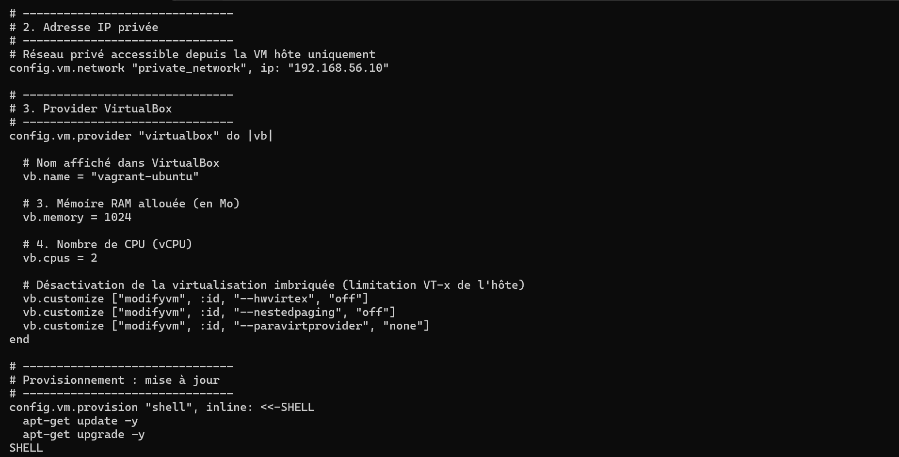

### 🔎 Vérification avec `vagrant status`

Après la configuration, la commande suivante permet de vérifier l'état de la VM :

```bash
vagrant status
```

Résultat :

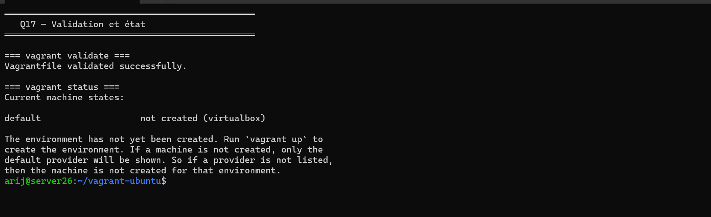

```

### ✅ Résultat

La VM est automatiquement configurée par **Vagrant** avec son nom, son adresse IP privée, sa mémoire RAM et son nombre de CPU définis dans le `Vagrantfile`.

**Attention :** j’ai repris `192.168.159.130` et `vagrant-vm` comme valeurs de configuration. Si ce ne sont pas exactement les valeurs visibles dans tes captures, envoie-moi simplement la capture du `Vagrantfile` et je te redonne la section avec **les valeurs exactes**.
```


# 📁 Structure du projet

```text
cv-onepage/
│
├── index.html
├── style.css
├── script.js
│
├── Dockerfile
├── nginx.conf
├── .dockerignore
├── docker-compose.yml
│
├── README.md
│
└── captures/
    ├── 01-ssh-service.png
    ├── 02-ssh-windows.png
    ├── 03-docker-installation.png
    ├── 04-docker-service-test.png
    ├── 05-jenkins-service.png
    ├── 06-jenkins-web.png
    ├── 07-mini-cv.png
    ├── 08-github-ssh-key.png
    ├── 09-github-ssh-test.png
    ├── 10-devsecops-portfolio.png
    ├── 11-devsecops-skills.png
    ├── 12-projects-dynamic.png
    ├── 13-docker-build-cv-docker.png
    ├── 14-docker-run-ps.png
    ├── 15-portfolio-docker-windows.png
    ├── 16-docker-compose-ps.png
    ├── 17-git-push-github.png
    ├── 18-vagrant-installation.png
    ├── 19-vagrantfile.png
    ├── 20-vagrant-up.png
    └── 21-vagrant-ssh.png
```

---

# 🌐 Liens

### 🔗 Dépôt GitHub

👉 **https://github.com/arijbelaid/cv-onepage**

### 🚀 Démo en ligne

👉 **https://arijbelaid.github.io/cv-onepage/**

---

# 👩‍💻 Auteur

**Arij Belaid**

Étudiante en **Master Pro DevOps & Cloud**

Titulaire d'une **Licence en Technologie de l'Informatique — Développement des Systèmes d'Information**.

Passionnée par :

* DevOps
* DevSecOps
* Cloud Computing
* Automatisation
* Conteneurisation
* CI/CD
* Infrastructure as Code
* Administration Linux

---

# 📌 Conclusion

Ce projet présente l'évolution progressive d'un **mini CV One Page** vers une application **DevSecOps Portfolio**.

Le projet met en pratique plusieurs compétences :

```text
HTML5 / CSS3 / JavaScript
          ↓
        Git
          ↓
       GitHub
          ↓
      SSH GitHub
          ↓
     Ubuntu Server
          ↓
        Docker
          ↓
        Nginx
          ↓
   Docker Compose
          ↓
       Jenkins
          ↓
       Vagrant
          ↓
  Automatisation
```

Cette évolution permet de mettre en œuvre les premières étapes d'une démarche **DevOps / DevSecOps**, depuis le développement et le versionnement jusqu'à la conteneurisation et l'automatisation.
